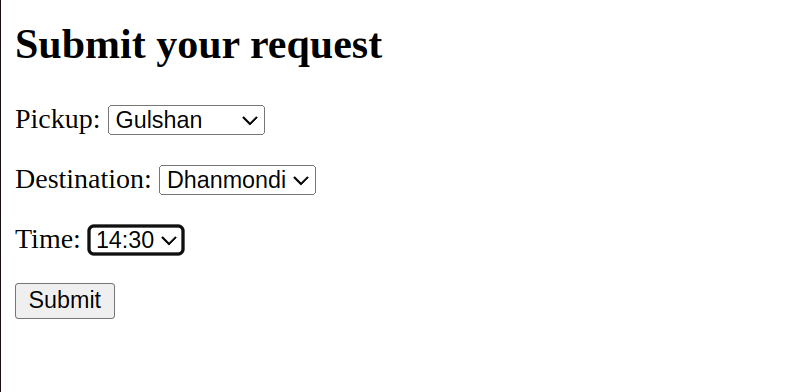
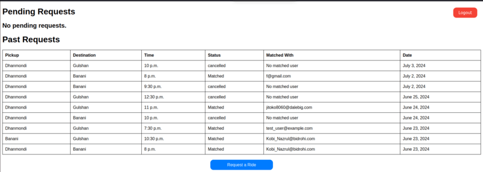

# ShareRide
ShareRide is a Django application that matches and connects users based on their travel schedules.

Users submit requests sharing their travel plan.





A background celery task runs every minute and matches users who share the same travel plan.

Users can see their request status from home page.



## Technologies
- Python 3.10
- Django
- Celery (with rabbitmq as broker)
- Docker
- HTML
- CSS

## Usage

1. Clone the repository:
   ```bash
    git clone https://github.com/FarzanRashid/ShareRide.git
    ```
2. Navigate to the project directory:
    ```bash
    cd /path/to/ShareRide
    ```

3. Create a .env file.


4. Configure the .env file by


4. Run the application
    ```bash
    docker compose up --build
    ```

5. Visit localhost:8000/signup/ for registration.
